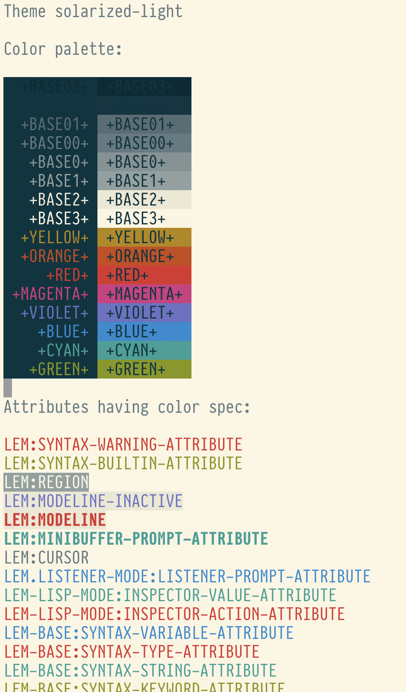

# lem-theme

This library provides a CLOS interface to [Lem](https://github.com/cxxxr/lem)'s color themes.

Its main feature is an ability to define attributes for the theme separately. For example, if you
are writing an extension for the Lem and want it render nicely in the Solarized color theme, then
you can specify which colours should be used for your attributes when Solarized theme is enabled:

```lisp

(lem:define-attribute link-attribute
  (:light :foreground "blue")
  (:dark :foreground "cyan"))

(lem-theme/spec:defspec (lem-solarized:solarized-light)
  (link-attribute :fg lem-solarized/colors:+blue+))

(lem-theme/spec:defspec (lem-solarized:solarized-dark)
  (link-attribute :fg lem-solarized/colors:+cyan+))

```

Also, you might use full power of CLOS to define your own themes based on existing ones:

```lisp

(defclass my-theme (lem-solarized:solarized-light)
    ())

(lem-theme/spec:defspec (my-theme)
  ;; here we'll redefine the modeline colors by making it RED
  ;; when it is active and VIOLET when it is inactive:
  (lem:modeline :fg lem-solarized/colors:+red+ :bg lem-solarized/colors:+base2+ :bold-p t)
  (lem:modeline-inactive :fg lem-solarized/colors:+violet+ :bg lem-solarized/colors:+base2+))
```

For loading the CLOS based theme, use:

```
(lem-theme/theme:load-theme 'my-theme)
```

This way, it will remember which theme is currently active, and automatically reload it when
you eval a new version of the `defspec` form or if you are loaded the extension which defines additional
attributes for the current color theme.

## Example of the color theme

Here is the piece of the Solarized color theme:

```lisp

(defclass solarized-light (theme)
  ((background-mode :initform :light)
   (background :initform +base3+)
   (foreground :initform +base03+)))

(defmethod lem-theme/theme:all-colors ((theme solarized-light))
  +all-colors+)

(defspec (solarized-light)
  (lem:cursor :fg :background :bg +base00+)
  (lem:syntax-warning-attribute :fg +red+)
  (lem:syntax-string-attribute :fg +cyan+)
  (lem:syntax-comment-attribute :fg +base01+)
  (lem:syntax-keyword-attribute :fg +green+)
  (lem:syntax-constant-attribute :fg +cyan+)
  (lem:syntax-function-name-attribute :fg +blue+)
  (lem:syntax-variable-attribute :fg +blue+)
  (lem:syntax-type-attribute :fg +red+)
  (lem:region :fg +base1+ :bg +base3+ :reverse-p t)
  (lem:minibuffer-prompt-attribute :fg +cyan+ :bold-p t)
  ;; Builtin functions and Lisp keyword symbols:
  (lem:syntax-builtin-attribute :fg +green+)
  (lem:modeline :fg +base01+ :bg +base2+ :bold-p t)
  (lem:modeline-inactive :fg +base00+ :bg +base2+))

```

## Other cool features

### Color palette

There is also the cool command `theme-colors`, which renders the current color theme's palette, like this:




### Hooks on theme loading/unloading

Solarized color theme uses this hook to make console colors exactly the same as
defined by [the spec](https://ethanschoonover.com/solarized/):

```lisp

(defmethod lem-theme/theme:on-load ((theme solarized-light))
  (lem-solarized/colors:change-colors))

```
